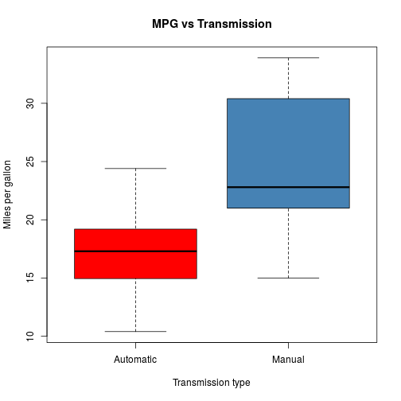

Motor Trend Car Road Tests Prediction
========================================================
author: Icaro Oliveira de Oliveira
date: February 22, 2015

Details
========================================================

The data was extracted from the 1974 Motor Trend US magazine, and comprises fuel consumption and 10 aspects of automobile design and performance for 32 automobiles (1973–74 models).

Statistical Inference
========================================================
Two Sample t-test was conducted between the different transmission types: manual (group 1) and automatic (group 0) transmissions and Miles per Gallon. 

```r
t.test(mpg ~ am, data = mtcars)
```

```

	Welch Two Sample t-test

data:  mpg by am
t = -3.7671, df = 18.332, p-value = 0.001374
alternative hypothesis: true difference in means is not equal to 0
95 percent confidence interval:
 -11.280194  -3.209684
sample estimates:
mean in group 0 mean in group 1 
       17.14737        24.39231 
```

Exploratory analysis
========================================================
Below, it is showed the correlation between the variables of mtcars.

 

Effect of Transmission Type on MPG of Cars
========================================================
In this analysis, we are interested in the effects of car transmission type on mpg. So, this plot clearly depicts that manual transmissions tend to have higher MPG.

 
